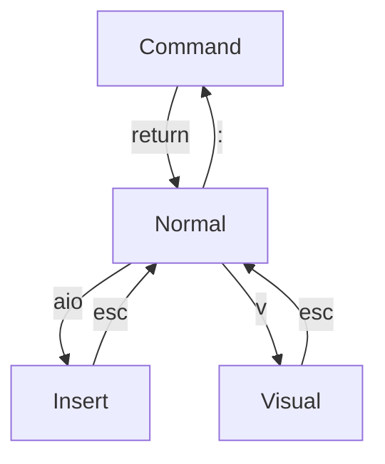

# Vim Helper

## Mode Overview

| topic | command | result                                                         |
| --- | ---- | --------------------------------------------------------------------|
| nvim | nvim -d file1 file2 | open nvim in diff mode for two files |
| nvim | nvim -d -o file2 file2      | open nvim in diff mode for horizontal split |

## control page view - nvim default

| topic | command | result                                                                      |
| --- | ---- | ---------------------------------------------------------------------------- |
| nvim | <ctrl>d    | 1/2 page down                                                                |
| nvim | <ctrl>u    | 1/2 page up                                                                  |
| nvim | <ctrl>a    | increment number under cursor by one                                         |
| nvim | <ctrl>x    | decrement number under cursor by one - overwritten by t-mux controls         |
| nvim | <ctrl>^    | toggle to last buffer  |
| nvim | <ctrl>w + [sc] | open new split, close split  |
| nvim | <ctrl>w + [hjkl] | move between panes in vim  |
| nvim | <ctrl>r    | redo, revert last undo with u |
| nvim | <ctrl>v    | vertical select for group action like A; for appending ; to each line end |

## control page view - settings with Telescope

| topic | command  | result                                                                      |
| --- | ----- | ---------------------------------------------------------------------------- |
| nvim | <ctrl>e     | exit nvim        |
| nvim | <ctrl>o     | URLopenunder Cursor |
| nvim | <ctrl>h     | open current html file in browser | 

## Command

enter _Command_ mode with : from _Normal_ mode

| topic | command             | result                                                               |
| --- | ------------------- | --------------------------------------------------------------------- |
| nvim | :h                  | show help file in new window split |
| nvim | :w                  | write file                                                            |
| nvim | :q!                 | exit file without save                                                |
| nvim | :wq                 | write file and exit                                                   |
| nvim | :qa                 | quit all buffers        |
| nvim | :0                  | jump to first line                                                    |
| nvim | :$                  | jump to last line                                                     |
| nvim | :%                  | use full file for operation                                           |
| nvim | :.!                 | perform Unix operator from shell and puts output in current buffer in overwrite |
| nvim | :ls                 | shows a list of all open buffers  |
| nvim | :b2                 | displays buffer 2  |
| nvim | :%s/search/subst/gc | use file, substitute _search_ with _subst_ globally with confirmation |
| nvim | :bufdo %s/search/subst/ge \| update | substitute in all files in buffer and write changed files |
| nvim | :reg                | show registers                                                        |
| nvim | :norm Ivar          | adds _var_ to the beginning of each line, in visual mode              |
| nvim | :set relativenumber | change line numbering to relative                                     |
| nvim | :put q              | paste register q to cursor position                                   |
| nvim | :so                 | source current file                                                   |
| nvim | :Man <page>         | opens the manpage for <page>     |
| nvim | :split              | horizontal split of buffer      |
| nvim | :vsplit             | vertical split of buffer |
| nvim | :sort               | sort all lines in visual mode                                         |
| nvim | :sort! u            | sort in reverse order and make unique                                 |
| nvim | :tab all | shows all opened files an tabs |
| nvim | :tabnew _filename_ | opens the _file_ in a new tab |
| nvim | :Lazy               | open lazy paket manager                                               |
| nvim | :e                  | open new file with given name in a new buffer                         |
| nvim | :InspectTree        | open parser for file with tree                                        |
| nvim | :Telescope marks | shows pop up with all marks - <space>cm  |
| nvim | :Telescope bibtex | shows the .bib citation - <space>cc |
| nvim | :Mason | open LSP server config |
| nvim | :LspInfo | provide info on installed language servers |
| nvim | :h vim.lsp.buf | provide help pages on LSP functionality |

## marks

| topic | key | result |
| --- | --- | ------- |
| nvim | mx  | set mark x |
| nvim | dmx | delete mark x|
| nvim | m]  | move to next mark |
| nvim | m[  | move to prev mark |

## language server / telescope

| topic | command | result |
| --- | --- | --- |
| nvim | <space>ff | telescope: picker for files |
| nvim | <space>fg | telescope: grep picker in folder |
| nvim | <space>fm | telescope: picker for marks |
| nvim | <space>fb | telescope: picker for buffers |
| nvim | <space>fc | telescope: picker for .bib citations |
| nvim | <space>ft | telescope: picker for latex todos |

## LSP Server

| topic | command | result |
| --- | --- | --- |
| nvim | <space>le | lsp: show error / warning message |
| nvim | <space>lh | lsp: code hover information in pop up |
| nvim | <space>la | lsp: code action |
| nvim | <space>lr | lsp: picker for code reference |
| nvim | <space>ld | lsp: picker for code definition |
| nvim | <space>lf | none_ls: update formatting with none_ls |

## git fugitive

| topic | command | result |
| --- | --- | --- |
| nvim | <space>gs | fugitive: Git status |
| nvim | <space>gd | fugitive: Git diff in h-split current vs. HEAD |
| nvim | <space>gb | fugitive: Git - who has last changed? |

## PDF - markdown

| topic | command | result |
| --- | --- | --- |
| nvim | <space>pg | PDF generate - PFD file from current file with pandoc |
| nvim | <space>pv | PDF view - view PDF version of current file in PDF viewer |

## debugger

| topic | command | result |
| --- | --- | --- |
| nvim | <space>db  | debugger: breakpoint toggle       |
| nvim | <space>dc  | debugger: continue                |
| nvim | <space>dt  | debugger: terminate               |
| nvim | <space>dv  | debugger: step over               |
| nvim | <space>di  | debugger: step in                 |
| nvim | <space>do  | debugger: step out                |

## vimtex
| topic | key | result |
| --- | --- | --- |
| nvim | :VimtexInfo | opens a window with vimtex information on system |
| nvim | :help vimtex-requirements | opens a window which shows requirements to run vimtex |
| nvim | :help vimtex | provides good documentation on vimtex |
| nvim | :help vimtex-default-mappings | provide list with all vimtex key mappings |
| nvim | :help vimtex-commands | show all vimtex commands |
| nvim | <space>xt | vimtex: toggle left window for TOC |
| nvim | <space>xc | vimtex: clean compiler files after problem |
| nvim | <space>xx | vimtex: toggle compiler on/off for .tex file to pdf in local folder |
| nvim | <space>xv | vimtex: view pdf of current file |
| nvim | <space>xe | vimtex: shows error log of Vimtex |
| nvim | [[ ]] | vimtex: jump to next/prev section |

## Treesitter

| topic | key | result |
| --- | --- | --- |
| nvim | <space>ti | treesitter: execute TSInstallInfo and show installed parsers |
| nvim | <space>tc | treesitter: execute TSContextToggle and show/hide inner context |
| nvim | <space>tp | treesitter: execute TSPlaygroundToggle and show/hide parser tree |

## NeoTree

| topic | key | result |
| --- | --- | --- |
| nvim | <space>nf     | neotree: focus file view left |
| nvim | <space>nb     | neotree: focus buffer view left |
| nvim | <space>nc     | neotree: close left view |
| nvim | a | neotree: add new file/folder |
| nvim | d | neotree: delete file |
| nvim | r | neotree: rename file |
| nvim | H | neotree: toggle hidden files |
| nvim | o | neotree: open file in system application, e.g. Firefox |

## Normal

| topic | motion  | result                                          |
| --- | ------- | ------------------------------------------------ |
| nvim | gt | switch to next tab |
| nvim | gg      | jump to first line                               |
| nvim | G       | jump to last line                               |
| nvim | H       | jump to top line                                 |
| nvim | L       | jump to bottom line                              |
| nvim | [hjkl] | left, down, up, right                            |
| nvim | K | opens man page or documentation for word under cursor |
| nvim | J | connects current line with next line, adds space between |
| nvim | w       | move to next word                                        |
| nvim | W       | move next whitespace                                  |
| nvim | b       | move prev word                                        |
| nvim | 0       | jump to first column in line                     |
| nvim | \_      | jumps to the first character in the current line |
| nvim | $       | jump to last character in line                   |
| nvim | /       | search all occurances of string                  |
| nvim | \*      | search all occurances of word under cursor       |
| nvim | n       | next occurance                                   |
| nvim | N       | prev occurance                                   |
| nvim | fx      | find first element x in current line               |
| nvim | ;       | jump to next element of char x in vurrent line |
| nvim | ,       | jump tpo prev element of x in current line |
| nvim | %       | jump to matching bracket ([{                     |
| nvim | !!      | short for :.! which runs shell command and pastes output in to buffer |

| topic | Enter Insert Mode | result                                        |
| --- | ----------------- | ---------------------------------------------- |
| nvim | a                 | append after cursor + enter insert mode        |
| nvim | A                 | append at eol + enter insert mode              |
| nvim | i                 | insert before cursor + enter insert mode       |
| nvim | I insert on left most column + enter insert mode |
| nvim | o                 | new line after + enter insert mode             |
| nvim | O                 | new line before + enter insert mode            |

| topic | Enter Visual Mode | result                                           |
| --- | ----------------- | ------------------------------------------------- |
| nvim | v                 | enter visual mode for character selection         |
| nvim | V                 | enter visual mode for line selection              |
| nvim | vG                | enter visual mode from current line till file end |
| nvim | vi(               | visual mode for everything inside bracket         |
| nvim | vt=               | visual mode for everything up to =                |
| nvim | vf= | visual mode for everything upt o and including = |
| nvim | <ctrl>v            | visual block: I# to start lines with # or A; for appending ; to each line end |

| topic | Editing | result                                                  |
| --- | ------- | -------------------------------------------------------- |
| nvim | dd      | normal: delete line + put in register 0-9                        |
| nvim | yy      | normal: yank line + put in register 0-9                          |
| nvim | x       | normal: delete char after cursor + put in register               |
| nvim | X       | normal: delete char before cursor                                |
| nvim | ~       | normal: toggle uppper/lower case under cursor                    |
| nvim | c       | normal: change mode                                              |
| nvim | p       | normal: paste after cursor                                       |
| nvim | P       | normal: paste before cursor                                      |
| nvim | u       | normal: undo last action                                         |
| nvim | .       | normal: redo last action                                         |
| nvim | J       | normal: joins current and next line to one line with space       |
| nvim | gv      | normal: reselect previous visual selection                       |
| nvim | ga      | normal: provide ASCII under cursor                               |
| nvim | gx      | normal: open URL under cursos in browser                         |
| nvim | gf      | normal: open text file under cursor                              |
| nvim | g? | does a 13 char cesar chiffre with selected text |
| nvim | gq      | normal, visual: wrap text into block with correct seperation     |
| nvim | guu     | normal: make line lower case                                     |
| nvim | gUU     | normal: make line upper case                                     |
| nvim | gg=G    | normal: jump to first line + correct indentation until last line |

| topic | delete/yank/change area | result                          |
| --- | ----------------------- | -------------------------------- |
| nvim | diw                     | normal: delete inner word                |
| nvim | yiw                     | normal: yank inner word                  |
| nvim | ciw                     | normal: change inner word                |
| nvim | di(                     | normal: delete inner bracket             |
| nvim | yi(                     | normal: yank inner bracket               |
| nvim | ci(                     | normal: change inner bracket             |
| nvim | da"                     | normal: delete outer ""                  |
| nvim | ya"                     | normal: yank outer ""                    |
| nvim | dt=                     | normal: delete to =                      |
| nvim | df=                     | normal: delete including = |
| nvim | ct=                     | normal: change to =                      |
| nvim | yt=                     | normal: yank to =                        |
| nvim | cW                      | normal: change all up to next whitespace |
| nvim | d$                      | normal: delete from current position to line end |

| topic | Markers | result                           |
| --- | ------- | --------------------------------- |
| nvim | mm      | normal: set mark m at current cursor      |
| nvim | 'm      | normal: jump to m mark                    |
| nvim | '.      | normal: jump to position of last change   |
| nvim | ''      | normal: jump to position before last jump |

| topic | Register | result                           |
| --- | -------- | --------------------------------- |
| nvim | "1diw    | register: delete word into register 1       |
| nvim | "\*d     | register: delete visual mode into clipboard |
| nvim | "1yiw    | register: yank word into register 1         |
| nvim | "\*y     | register: yank into clipboard               |
| nvim | "1p      | register: paste from register 1             |
| nvim | "\*p     | register: paste from clipboard              |

| topic | Makros | result                                |
| --- | ------- | -------------------------------------- |
| nvim | qa.q    | start makro with name _a_ and record . |
| nvim | @a      | replay makro with name _a_             |
| nvim | 3@a     | replay makro with name _a_ 3 times     |

| topic | command | result                                |
| --- | ------- | -------------------------------------- |
| nvim | >       | visual: shift one tab right                    |
| nvim | <       | visual: shift one tab left                     |
| nvim | 3>      | visual: shift 3 tabs right                     |
| nvim | 3<      | visual: shift 3 tabs left                      |
| nvim | d       | visual: delete + put in register               |
| nvim | y       | visual: yank + put in register                 |
| nvim | J       | visual: joins lines in visual mode to one line |
