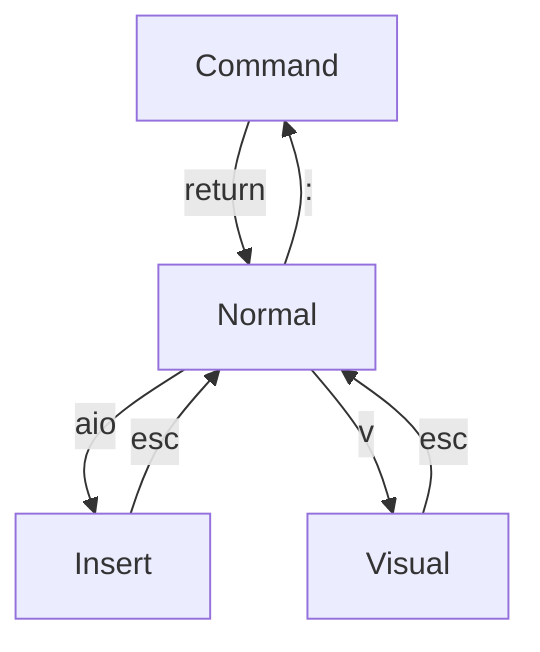

# Vim Helper

## Mode Overview

## enter diff mode

nvim -d file1 file2 
nvim -d -o file2 file2      -- for horizontal split

## control page view - nvim default

| command | comment                                                                      |
| ---- | ---------------------------------------------------------------------------- |
| <ctrl>d    | 1/2 page down                                                                |
| <ctrl>u    | 1/2 page up                                                                  |
| <ctrl>a    | increment number under cursor by one                                         |
| <ctrl>x    | decrement number under cursor by one - overwritten by t-mux controls         |
| <ctrl>^    | toggle to last buffer  |
| <ctrl>w + [sc] | open new split, close split  |
| <ctrl>w + [hjkl] | move between panes in vim  |
| <ctrl>v    | vertical select for group action like _$A;_ for appending ; to each line end |

## control page view - settings with Telescope

| command  | comment                                                                      |
| ----- | ---------------------------------------------------------------------------- |
| <ctrl>e     | exit nvim        |
| <ctrl>q     | open neo-tree view |
| <ctrl>o     | URLopenunder Cursor |
| <ctrl>r     | open current html file in browser | 
| <ctrl>f     | find file with telescope in popup |
| <ctrl>g     | search files with grep in popup   |
| <ctrl>m     | open marks in popup with telescope |
| <ctrl>b     | open buffers in popup with telescope |

## Command

enter _Command_ mode with : from _Normal_ mode

| command             | comment                                                               |
| ------------------- | --------------------------------------------------------------------- |
| :w                  | write file                                                            |
| :q!                 | exit file without save                                                |
| :wq                 | write file and exit                                                   |
| :qa                 | quit all buffers        |
| :0                  | jump to first line                                                    |
| :$                  | jump to last line                                                     |
| :%                  | use full file for operation                                           |
| :!                  | perform Unix operator from shell                                      |
| :ls                 | shows a list of all open buffers  |
| :b2                 | displays buffer 2  |
| :%s/search/subst/gc | use file, substitute _search_ with _subst_ globally with confirmation |
| :bufdo %s/search/subst/ge \| update | substitute in all files in buffer and write changed files |
| :reg                | show registers                                                        |
| :norm Ivar          | adds _var_ to the beginning of each line, in visual mode              |
| :set relativenumber | change line numbering to relative                                     |
| :put q              | paste register q to cursor position                                   |
| :so                 | source current file                                                   |
| :split              | horizontal split of buffer      |
| :vsplit             | vertical split of buffer |
| :sort               | sort all lines in visual mode                                         |
| :sort! u            | sort in reverse order and make unique                                 |
| :tab all | shows all opened files an tabs |
| :tabnew _filename_ | opens the _file_ in a new tab |
| :Lazy               | open lazy paket manager                                               |
| :e                  | open new file with given name in a new buffer                         |
| :InspectTree        | open parser for file with tree                                        |
| :Telescope marks          | shows pop up with all marks - <ctrl>m  |
| :Mason | open LSP server config |
| :LspInfo | provide info on installed language servers |
| :h vim.lsp.buf | provide help pages on LSP functionality |

## marks

| key | comment |
| --- | ------- |
| mx  | set mark x |
| dmx | delete mark x|
| m]  | move to next mark |
| m[  | move to prev mark |

## language server

| command | comment |
| --- | --- |
| <space>cu | update style with none_ls |
| <space>ch | code hover information for content below cursor |
| <space>cd | code definition with trelescope |
| <space>cr | code reference with telescope |
| <space>ca | code action |

## PDF - latex

| command | comment |
| --- | --- |
| <space>pg  | PDF generate - PFD file from current file with pandoc |
| <space>pv  | PDF view - view PDF version of current file in PDF viewer |

## debugger

| command | comment |
| --- | --- |
| <space>db  | debugger: breakpoint toggle       |
| <space>dc  | debugger: continue                |
| <space>dt  | debugger: terminate               |
| <space>dv  | debugger: step over               |
| <space>di  | debugger: step in                 |
| <space>do  | debugger: step out                |

## NeoTree

| key | comment |
| --- | --- |
| a | neotree: create new file/folder |
| d | neotree: delete file |
| r | neotree: rename file |
| H | neotree: toggle hidden files |
| o | neotree: open file in system application, e.g. Firefox |

## Normal

Enter _Normal_ mode with esc from _Insert_ or _ Visual_ mode

Enter _Normal_ mode with return from _Command_ mode

| motion  | comment                                          |
| ------- | ------------------------------------------------ |
| gt | switch to next tab |
| gg      | jump to first line                               |
| G       | juump to last line                               |
| H       | jump to top line                                 |
| L       | jump to bottom line                              |
| h j k l | left, down, up, right                            |
| w       | next word                                        |
| W       | next whitespace                                  |
| b       | prev word                                        |
| 0       | jump to first column in line                     |
| \_      | jumps to the first character in the current line |
| $       | jump to last character in line                   |
| /       | search all occurances of string                  |
| \*      | search all occurances of word under cursor       |
| n       | next occurance                                   |
| N       | prev occurance                                   |
| f       | find first element in current line               |
| %       | jump to matching bracket ([{                     |

| Enter Insert Mode | comment                                        |
| ----------------- | ---------------------------------------------- |
| a                 | append after cursor + enter insert mode        |
| A                 | append at eol + enter insert mode              |
| i                 | insert before cursor + enter insert mode       |
| I                 | insert on left most column + enter insert mode |
| o                 | new line after + enter insert mode             |
| O                 | new line before + enter insert mode            |

| Enter Visual Mode | comment                                           |
| ----------------- | ------------------------------------------------- |
| v                 | enter visual mode for character selection         |
| V                 | enter visual mode for line selection              |
| vG                | enter visual mode from current line till file end |
| vi(               | visual mode for everything inside bracket         |
| vt=               | visual mode for everything up to =                |
| <ctrl>v            | start visual block and use I# to start all lines with # |

| Editing | comment                                                  |
| ------- | -------------------------------------------------------- |
| dd      | normal: delete line + put in register 0-9                        |
| yy      | normal: yank line + put in register 0-9                          |
| x       | normal: delete char after cursor + put in register               |
| X       | normal: delete char before cursor                                |
| ~       | normal: toggle uppper/lower case under cursor                    |
| c       | normal: change mode                                              |
| p       | normal: paste after cursor                                       |
| P       | normal: paste before cursor                                      |
| u       | normal: undo last action                                         |
| .       | normal: redo last action                                         |
| J       | normal: joins current and next line to one line with space       |
| gv      | normal: reselect previous visual selection                       |
| ga      | normal: provide ASCII under cursor                               |
| gx      | normal: open URL under cursos in browser                         |
| gf      | normal: open text file under cursor                              |
| guu     | normal: make line lower case                                     |
| gUU     | normal: make line upper case                                     |
| gg=G    | normal: jump to first line + correct indentation until last line |

| delete/yank/change area | comment                          |
| ----------------------- | -------------------------------- |
| diw                     | normal: delete inner word                |
| yiw                     | normal: yank inner word                  |
| ciw                     | normal: change inner word                |
| di(                     | normal: delete inner bracket             |
| yi(                     | normal: yank inner bracket               |
| ci(                     | normal: change inner bracket             |
| da"                     | normal: delete outer ""                  |
| ya"                     | normal: yank outer ""                    |
| dt=                     | normal: delete to =                      |
| ct=                     | normal: change to =                      |
| yt=                     | normal: yank to =                        |
| cW                      | normal: change all up to next whitespace |
| d$                      | normal: delete from current position to line end |

| Markers | comment                           |
| ------- | --------------------------------- |
| mm      | normal: set mark m at current cursor      |
| 'm      | normal: jump to m mark                    |
| '.      | normal: jump to position of last change   |
| ''      | normal: jump to position before last jump |

| Register | comment                           |
| -------- | --------------------------------- |
| "1diw    | delete word into register 1       |
| "\*d     | delete visual mode into clipboard |
| "1yiw    | yank word into register 1         |
| "\*y     | yank into clipboard               |
| "1p      | paste from register 1             |
| "\*p     | paste from clipboard              |

| Makros | comment                                |
| ------- | -------------------------------------- |
| qa.q    | start makro with name _a_ and record . |
| @a      | replay makro with name _a_             |
| 3@a     | replay makro with name _a_ 3 times     |

## Visiual

| command | comment                                |
| ------- | -------------------------------------- |
| >       | visual: shift one tab right                    |
| <       | visual: shift one tab left                     |
| 3>      | visual: shift 3 tabs right                     |
| 3<      | visual: shift 3 tabs left                      |
| d       | visual: delete + put in register               |
| y       | visual: yank + put in register                 |
| J       | visual: joins lines in visual mode to one line |
